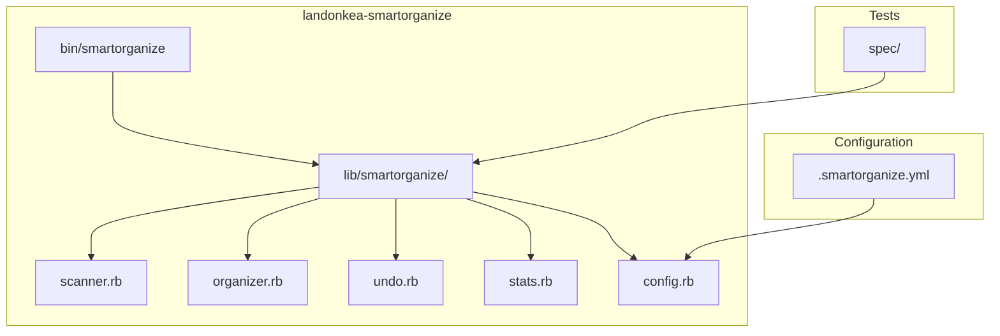
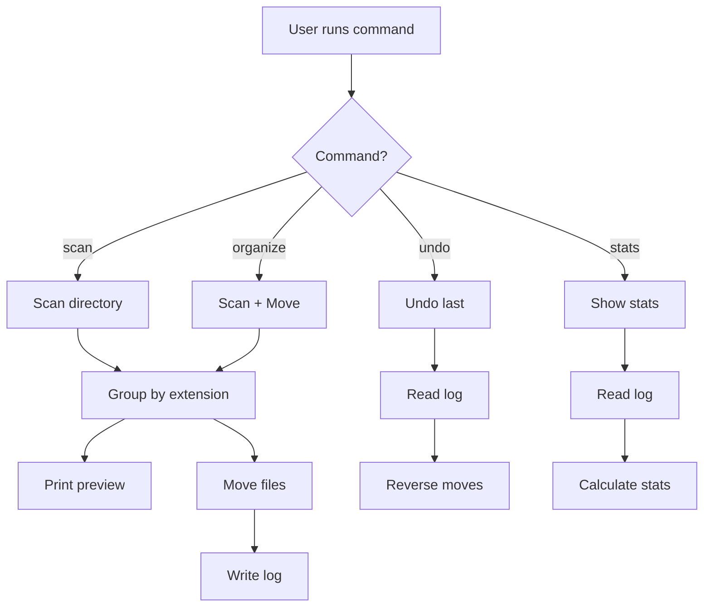
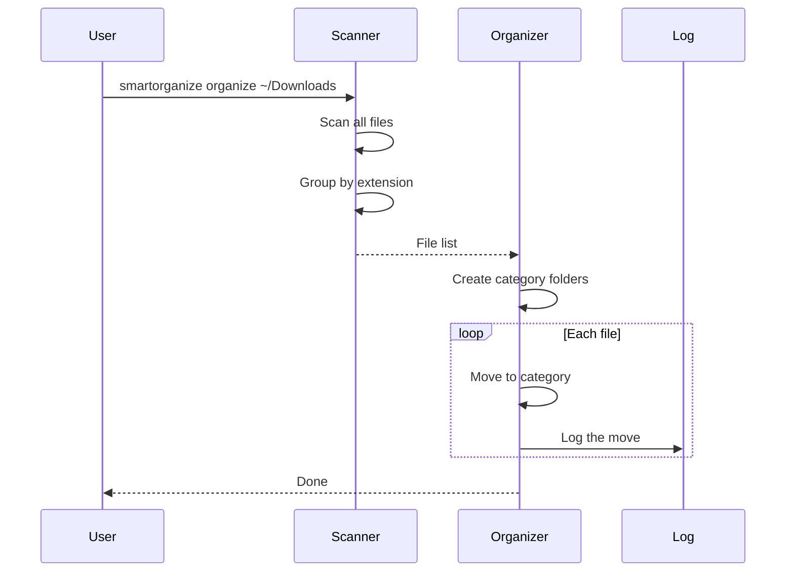

# landonkea-smartorganize - Design & Workflow

## High-Level Overview

## Command Workflow

## File Organization Flow

## File Relationships

| File | Purpose | Used By |
|------|---------|---------|
| `bin/smartorganize` | CLI entry point | User |
| `lib/smartorganize/scanner.rb` | Scan files | Organizer |
| `lib/smartorganize/organizer.rb` | Move files | CLI |
| `lib/smartorganize/undo.rb` | Undo moves | CLI |
| `lib/smartorganize/stats.rb` | Show stats | CLI |
| `lib/smartorganize/config.rb` | Load config | Scanner |
| `spec/` | Tests | RSpec |

## draw.io

[Open in draw.io](https://app.diagrams.net/#RSmartorganize%20architecture)
